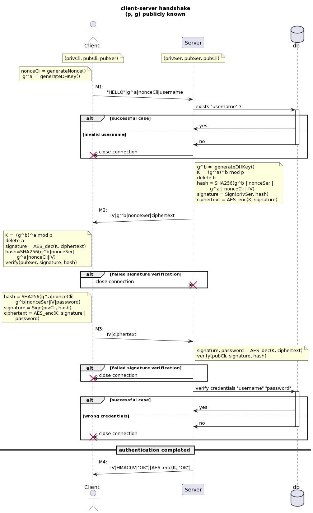
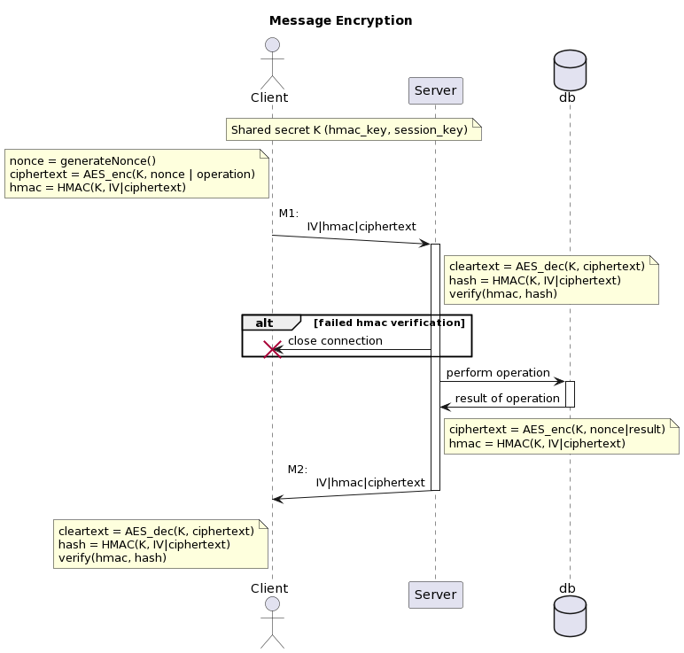
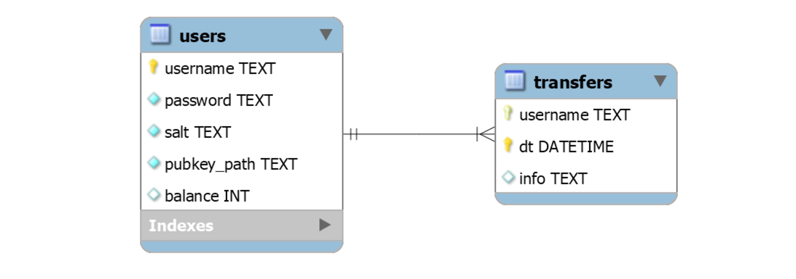

# Introduction

The application's features are described in the requirements document that was assigned for this project.
The service is primarily composed of two CLI programs: the `client` and the `server` which communicate using sockets. The TCP protocol has been chosen for all communication, as it provides reliable, in-order and error-checked delivery of packets, necessary for the security requirements of this application.
The client must be started specifying the ip address and the port on which to find the server; meanwhile the server only requires to specify the port it should listen to.

The list of available functionalities are:

- For the client:
  - logging in to the SBA service. This is done automatically at application startup and after each session expiration
  - seeing the list of available commands through the `help` command
  - getting the current balance via `balance`
  - transferring money to another user using the `transfer` command and specifying the receiver's username and the amount to send
  - listing the last 3 (configurable by code on the server side) transfers performed by the user. Every transfer is saved on the database but only the last ones are returned.

- For the server:
  - terminating the server via the `quit` command. All user's information are saved on the database but all sessions would be lost.

Storing of user's credentials, balances and transfers is done using an SQLite file database[^1]. 

[^1]: Source code for the library used to access the database is available at https://www.sqlite.org/index.html

# Protocols used

Communication between client and sever must be authenticated, fulfill confidentiality and be resilient to replay attacks, as per requirements. Also the authentication protocol must satisfy the Perfect Forward Secrecy property. For this reason the key establishment protocol chosen is based upon the Station-to-Station protocol, which fulfills direct authentication while guaranteeing PFS.

## Shared secret generation and PFS

The schema for the key establishment protocol can be seen in Figure 1 . Global parameters $p, g$ are known constants. Each principal knows its public and private key, and each other's public key.

Note that a major difference from the standard STS protocol is the absence of any certificate exchanged between client and server. This is because it is assumed that both parties already know each other's Public Key.

The rationale behind this protocol is as follows:

1. Client begins the communication generating new DH parameters, which are sent in cleartext to the Server in message M1 along with the string literal "HELLO" and a nonce. The latter is used to guarantee the freshness of the message.
2. The sever checks that the received username exists in the database. It then generates its own nonce and DH parameters and with the latter, it obtains the shared secret K. It then concatenates both DH parameters, both nonces and the IV and computes its hash. The server then signs this hash with its private key and sends it encrypted with the shared secret, along with server's DH parameter and nonce: message M2.
3. Client receives server's DH parameter and with it it is able to compute the shared secret. Client uses it to decrypt the ciphertext. It then generates the hash of the encrypted content and verifies server's signature by confronting it with the computed hash, using server's public key. The client then sends message M3 with IV and a ciphertext: the ciphertext is obtained by encrypting the concatenation of user's password and the client's signature of the computed hash.
4. Server decrypts the ciphertext with the shared secret and verifies the client's signature by confronting it with the previously computed hash, using client's public key. Server then verifies user's credentials (username and password) with the hashes stored in the database.

5. Finally, if client's credentials pass the verification, the string "OK" is sent as an ack to the client using the message encryption protocol. Message M4

After this handshake, both server and client agree on the same  pair of keys for encryption and HMAC. 

## Message encryption

The schema for an authenticated communication between client and server is shown in Figure 2. 

The shared secret obtained in the authentication phase is subdivided into a pair of keys:

- a session key of 128 bits used to encrypt and decrypt messages using the AES128 symmetric encryption algorithm
- an hmac key of 256 bits to perform message authentication through the SHA256 hashing algorithm

If at any point, the server receives a message containing a previously seen nonce, it aborts its operation, as this might be caused by a replay attack.

Each message that wants to transmit a plaintext contains:

- the IV
- the hmac of the concatenation of the IV with the ciphertext, obtained using the shared hmac_key
- the ciphertext, which encrypts the nonce and the plaintext, using the shared session_key

## Database schema

The database ER schema is shown in Figure 3. The `password` field in the `users` table stores users' passowrds as the base64 encoding of the SHA256 hash, salted with a randomly chosen value (stored in `salt`). The field `pubkey_path` stores the relative path where the server can find users' public key in `.pem` format. Using `sqlite` special `CHECK` syntax, the balance of each user is atomically assured to always be non-negative. The `transfers` table only contains the sender's username and the datetime of the transaction as clear text. Information regarding the receiver's username and the amount of the transaction are stored in the `info` field after being RSA encrypted with the sender's public key. Therefore only the sender is able to view its transactions, by decrypting them locally with its private key.

